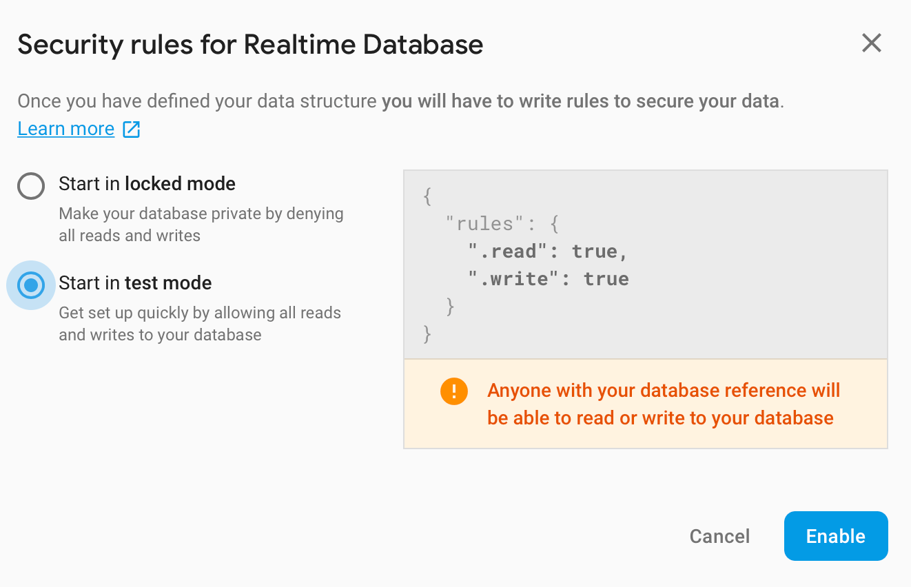
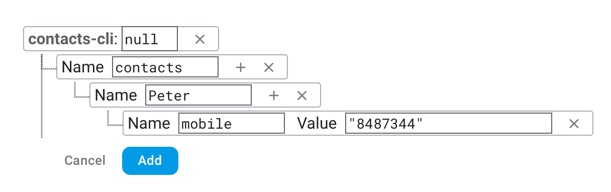

For the next phase in this series, we'll learn how to make a CLI app to perform CRUD operations, i.e, Creating, Retrieving, Updating and Deleting data. We'll use Firebase to store our data.

## What we'll create
A `contacts` app with the following functionality:

```bash
# add a new contact with name=Peter and mobile=01034512
$ contacts add Peter --mobile 01034512
Contact Peter added!
{ 'mobile': '01034512' }
```

```bash
# view all contacts
$ contacts list
Here's a list of all your contacts:
{ ...  # list of all contacts }
```

```bash
# view single contact
$ contacts view Peter
{ 'mobile': '01034512' }

$ contacts view Meg
The contact you searched for doesn't exist
```

```bash
# update mobile number for Peter
$ contacts update Peter --mobile 00000
Contact updated!
{ 'mobile': '00000' }
```

```bash
# delete the contact Peter
$ contacts delete Peter
Contact deleted!
```

<small> This post is a bit long. If you just want to take a look at the code or see how the app works, check out [the repo](https://github.com/wangonya/contacts-cli).</small>

## Setting up Firebase
As mentioned earlier, Firebase will be used to store our data. To set up the database, sign in on <a href="https://firebase.google.com" target="_blank">Firebase</a> using your google account.

After signing in successfully, click on the **Go to console** button on the top right. There, you can create a new project. Follow the required steps to create a new project.

Once the project is created, you'll see a **Develop** sidebar on the left. Click on **Database** to set up the database. **Cloud Firestore** will be displayed as the first option but that's not what we'll be using. Scroll down and you'll see a **Realtime Database** option. Click on **Create database**. Next, you'll be presented with the security options.



Since we'll not be handling authentication, choose **Start in test mode** for the security rules. Your database is now created 🎉


Now for the final step in setting up the database, click on the little plus sign **+** to add a new child node called **contacts**. This will hold our contacts (obviously 😅). Also, add a test contact just to see how the database will be structured.



The database should now look like this:


## App setup
We've already gone through the basics of setting up in previous posts so I won't go into much detail on that. Here are the steps:

```bash
$ mkdir contacts-cli

$ cd contacts-cli

$ virtualenv env

$ . env/bin/activate

(env) $ mkdir app

(env) $ touch app/__init__.py

(env) $ touch setup.py

(env) $ touch .env
```

#### `.env`
This is where the api endpoint url will be stored. Firebase [provides a REST API](https://firebase.google.com/docs/reference/rest/database) for the database so that's what we'll use. If you already followed the steps and created the database, just grab the link provided at the top of the database and set it in your `.env` file.

```bash
export URL=https://[YOUR_PROJECT_ID].firebaseio.com
```

Make sure to run `. .env` to load your environment variables, otherwise `URL` will be `None`.

#### `setup.py`
To learn more about the `setup` file, you can go back to [this](https://wangonya.com/blog/using-setuptools/) post.

```python
from setuptools import setup, find_packages

setup(
        name="contacts",
        py_modules=find_packages(),
        install_requires=[
            "Click",
            "requests",
            ],
        entry_points="""
        [console_scripts]
        contacts=app:cli
        """,
        )
```

Then run `pip install --editable .` in your terminal to install the app.

#### `app/__init__.py`
```python
import click

@click.group(invoke_without_command=True)
@click.pass_context
def cli(ctx):
    if ctx.invoked_subcommand is None:
        click.echo("Welcome to the contacts app 🥳")
        click.echo("Run contacts --help for options.")
```

We need to use `@click.group` to allow us to include sub-commands.


If the main command is invoked without any sub-command, a welcome message is shown. How does the main command know if a sub-command has been passed in or not? By looking at the context. `if ctx.invoked_subcommand is None`, then no sub-command has been passed - show the welcome message.

Everything is setup now, so we can start working on the functionality.

## Creating contacts

```python
import os
import requests
import click

...

@cli.command()
@click.argument('name')
@click.option('--mobile', '-m', required=True)
def add(name, mobile):
    """
    Add a new contact
    """
    response = requests.put('{}/contacts/{}.json'
                            .format(os.getenv('URL'), name),
                            json={'mobile': '{}'.format(mobile)})
    click.echo('Contact {} added!'.format(name))
    click.echo(response.json())
```

You'll notice that I used `PUT` for the request instead of `POST`. I did this to avoid generating unique IDs for my data on Firebase. Feel free to use `POST` instead and see how you can work with the generated UIDs.

The `add` command takes two parameters - a `name` argument, and a `mobile` option. Both are required. Running `contacts add --help` shows us what options we have.

```bash
(env) $ contacts add --help

Usage: contacts add [OPTIONS] NAME

  Add a new contact

Options:
  -m, --mobile TEXT  [required]
  --help             Show this message and exit.
```

Let's add a new contact:

```bash
(env) $ contacts add Chris -m 34243234
Contact Chris added!
{'mobile': '34243234'}
```


## Getting all contacts

```python

...

@cli.command()
def list():
    """
    View all contacts
    """
    response = requests.get('{}/contacts.json'
                            .format(os.getenv('URL')))
    click.echo('Here\'s a list of all your contacts:')
    click.echo(response.json())
```

The `list` command simply does a `GET` request on the contacts node and returns the result.

```bash
(env) $ contacts list
Here's a list of all your contacts:
{'Chris': {'mobile': '34243234'}, 'Peter': {'mobile': '8487344'}}
```

## Getting one contact

```python

...

@cli.command()
@click.argument('name')
def view(name):
    """
    View single contact
    """
    response = requests.get('{}/contacts/{}.json'
                            .format(os.getenv('URL'), name))
    if not response.json():
        click.echo("The contact you searched for does'nt exist")
    else:
        click.echo(response.json())
```

The `view` command is similar to `list`, except it takes a `name` argument and adds it to the url to return the contact for that name only. If the name doesn't exist in the database, `null` is returned. We take advantage of that in the `if` block to return the appropriate response.

```bash
(env) $ contacts view Peter
{'mobile': '8487344'}

(env) $ contacts view Meg
The contact you searched for doesn't exist
```

## Updating a contact

```python

...

@cli.command()
@click.argument('name')
@click.option('--mobile', '-m', required=True)
def update(name, mobile):
    """
    Update contact
    """
    response = requests.patch('{}/contacts/{}.json'
                              .format(os.getenv('URL'), name),
                              json={'mobile': '{}'.format(mobile)})
    click.echo('Contact updated!')
    click.echo(response.json())
```

This works exactly the same to the create command, except we're using `PATCH` instead of `PUT` (which apparently, doesn't make any difference here. Making a `PATCH` on a non-existent node creates it, just like `PUT` would do. Try it out.)

```bash
(env) $ contacts update Peter -m 552
Contact updated!
{'mobile': '552'}
```

## And finally, deleting a contact

Similar to the `view` command. The only change we'll make is using `DELETE` instead of `GET`.

```python

...

@cli.command()
@click.argument('name')
def delete(name):
    """
    Delete contact
    """
    requests.delete('{}/contacts/{}.json'
                    .format(os.getenv('URL'), name))
    click.echo('Contact deleted!')
```

`null` is returned on successful deletion so we don't require to return `response`. The `request` is called directly, and a success message is shown afterwords. This can be done better but it'll do for now.

```bash
(env) $ contacts delete Peter
Contact deleted!
```

I meant to cover exporting (writing) the data to a local JSON file or sqlite database, but this post is already too long 😅. These are interesting things to try if you want to learn more.

In the next post, we'll add tests to the app using pytest.
