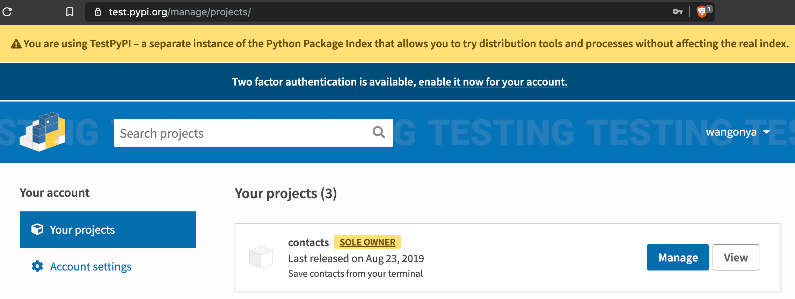

If you're just creating a package for learning purposes, there's no need (IMO) to pollute the official PyPi index with it. Also, you may want to release a package to a select number of users for testing before you actually release it officially. For these purposes, you're better off using [TestPyPi](https://test.pypi.org/):

> a separate instance of the Python Package Index that allows you to try distribution tools and processes without affecting the real index.

## Uploading to TestPyPi
For the final part of this series, I'll upload the app we created on TestPyPi. Here are the steps to follow:

#### 1. Create an account on TestPyPi
You'll need an account to continue so head over to [https://test.pypi.org/](https://test.pypi.org/) and create one.

#### 2. Update `setup.py`
We kept the `setup.py` file very simple during development. Now we'll need to add some details to make it ready for publishing.

```python
from setuptools import setup, find_packages

with open("README.md", "r") as fh:
    long_description = fh.read()

setup(
        name="contacts",
        version="0.1.0",
        packages=find_packages(),
        description="Save contacts from your terminal",
        long_description=long_description,
        long_description_content_type="text/markdown",
        url="https://github.com/wangonya/contacts-cli",
        author="Kinyanjui Wangonya",
        author_email="kwangonya@gmail.com",
        license="MIT",
        classifiers=[
            "License :: OSI Approved :: MIT License",
            "Programming Language :: Python :: 3",
            "Programming Language :: Python :: 3.7",
        ],
        install_requires=[
            "Click",
            "requests",
            ],
        entry_points="""
        [console_scripts]
        contacts=app:cli
        """,
        )

```

Most of the options are self-explanatory, but you can check what each of them means in the [setup docs](https://setuptools.readthedocs.io/en/latest/setuptools.html#new-and-changed-setup-keywords).


#### 3. Build your package
In the root directory, run:

```
(env) $ python setup.py sdist bdist_wheel
```

This will generate a `dist` folder with the distribution packages:

```
dist/
├── contacts-0.1.0-py3-none-any.whl
└── contacts-0.1.0.tar.gz
```

#### 4. Upload your package with twine
Install twine:

```
$ pip install twine
```

Upload your package:

```
$ twine upload --repository-url https://test.pypi.org/legacy/ dist/*
Enter your username: wangonya
Enter your password:
Uploading distributions to https://test.pypi.org/legacy/
Uploading contacts-0.1.0-py3-none-any.whl
100%|███████████████████████████████████████████████████████████|
Uploading contacts-0.1.0.tar.gz
100%|███████████████████████████████████████████████████████████|
```

The package should now be uploaded on your account:



To install the package locally from TestPyPi, run:

```
$ pip install --index-url https://test.pypi.org/simple/ --extra-index-url https://pypi.org/simple your-package
```

`--index-url` tells pip to get the package from TestPyPi. If the package needs other dependencies to run, `--extra-index-url` has to be included so the dependencies can be fetched from the PyPi.

That's it 😀.

Once you get a hang of this process and everything works fine, publishing to the official PyPi index should be easy as pie 😅.
