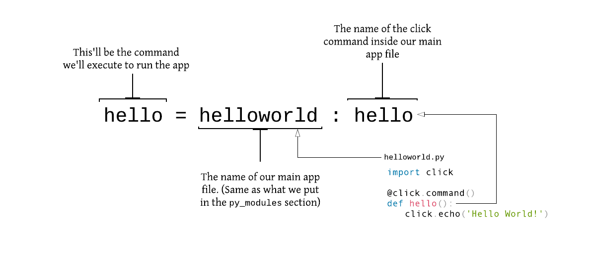

In our previous post, we made a Hello World! app to get us started with Click. You might have noticed though that we needed to do `python hello-world.py` to run it. Since we're building CLI apps, that's just not cool 😅 and it's not how CLI apps work anyway. We need to be able to run a single command, something like:

```bash
(venv) $ hello
Hello World!
```

That's where [setuptools](https://setuptools.readthedocs.io/en/latest/) comes in. Setuptools helps us bundle our script so we can install it and run it like an app (`$ hello`), instead of like a script (`$ python hello-world.py`).

> Setuptools is a collection of enhancements to the Python distutils that allow developers to more easily build and distribute Python packages, especially ones that have dependencies on other packages.  - <small><a target="_blank" href="https://setuptools.readthedocs.io/en/latest/setuptools.html">Docs</a></small>

Ok, enough chit-chat. Let's get this working. The first thing we'll need to do is add a new file to our project and call it `setup.py`. We'll also rename `hello-world.py` to `helloworld.py` (remove the dash). I'll explain why this is necessary when we get to the `setup()` section. Our project structure should now look like this:

```bash
hello-world-cli
    |- helloworld.py  # renamed from hello-world.py
    |- setup.py  # new file
```

In the `helloworld.py`, remove the `if __name__ == '__main__':` section. The code should now look like this:

```python
import click

@click.command()
def hello():
    click.echo('Hello World!')
```

In the `setup.py` file, add this code:

```python
from setuptools import setup

setup(
    name='hello-world-cli',
    py_modules=['helloworld'],
    install_requires=[
        'Click',
    ],
    entry_points='''
        [console_scripts]
        hello=helloworld:hello
    ''',
)
```

Let's examine what each line of code does.

```python
from setuptools import setup
```

We need to import `setup` from `setuptools` in order to use it.

Next, we call the `setup()` function and pass in a number of parameters:

```python
name='hello-world-cli'
```

This'll be the name of our CLI app.

```python
py_modules=['helloworld']
```

This tells the `setup()` where to find our main module to execute. Our main file here is `helloworld.py` so we set `helloworld` as the module. We can keep it that simple since we only have one file for now, but as our app grows we'll replace `py_modules` with `packages=find_packages()`. More on that later.

```python
install_requires=['Click']
```

Our app has Click as a dependancy, so it needs to be installed for it to work. `setup()` needs to know about this so it can include it as it packages our project. `install_requires` accepts a list of values, so if we had more dependencies, we would list all of them here.

```python
entry_points='''
          [console_scripts]
          hello=helloworld:hello
      '''
```

This is the part that saves us the hassle of having to run the app with `python ...` everytime, and enables us to just execute `hello` to run it.



<small><strong>It's important to note that if we maintained our previous name </strong>(`hello-world.py`)<strong>, the </strong>`setup` <strong>would have failed at </strong>`entry_points`. <strong> This is because python module names shouldn't have dashes.</strong></small>

We can now install our app in our environment and run it. To install it, run:

```bash
(venv) $ pip install --editable .
```

Then execute the created command:

```bash
(venv) $ hello
Hello World!
```

Pretty neat, right? 😃

In the next post, we'll take a closer look at Click Commands, Options & Arguments, and how we can use them to make our app even better.
